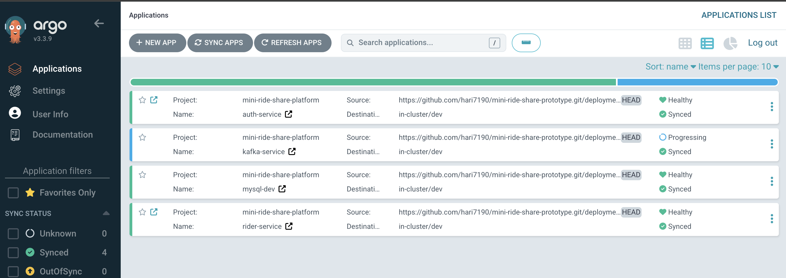

# Mini Ride-Share Platform (Spring Boot + Kafka + K8s)

This project is a small ride-share style app I built to practice and demo that I can take something from idea to production-ish setup.

It covers the full flow: 

- writing backend services in Java/Spring Boot, 
- wiring async events with Kafka, 
- storing core data in MySQL, 
- using Redis for fast lookups, and 
- adding Python jobs for background processing/analytics.

Then I deploy everything on **Kubernetes** and manage releases the **GitOps** way with ArgoCD on a **Bare-Metal cluster**. 

Hardware - R720 PowerEdge Server x 4 (From my **Homelab**)

The goal isn’t to build a full Uber clone - it’s to show practical engineering skills across:

- service design and API development
- event-driven architecture
- caching + database usage
- containerization and K8s deployment
- CI/CD + GitOps workflows
- basic scaling patterns (replicas, Kafka partitions, stateless services)

You can think of it as a “real-world-ish” demo project that proves I can design, code, ship, and scale a distributed system with a modern stack.

---
## Diagrams & Screenshots

## Argo CD

---

## Technical Details

*TODO: Update README as I progress through implementation*

### App will (probably) contain

- auth-gateway-service
- rider-service
- driver-service
- dispatch-engine
- location-tracker
- common-dto

### K8s related setup

- Enabled metallb for provisioning LBs
- Enabled microk8s dashboard
- Installed argocd
- brought in remote config from cluster host into laptop
- patched svc for k8s and argocd dashboards
  > kubectl patch svc kubernetes-dashboard-kong-proxy -n kubernetes-dashboard -p '{"spec": {"type": "LoadBalancer"}}'
  >
  > kubectl patch svc argocd-server -n kubernetes-dashboard -p '{"spec": {"type": "LoadBalancer"}}'

Things to automate
- Configure mysql password, jwt secret, dockerhub as secrets outside of git
- Creating ingress-controller(nginx) & Patch it to type LB
 > kubectl apply -f https://raw.githubusercontent.com/kubernetes/ingress-nginx/controller-v1.10.1/deploy/static/provider/baremetal/deploy.yaml
 >
 > kubectl patch svc ingress-nginx-controller -n ingress-nginx -p '{"spec": {"type": "LoadBalancer"}}'

#### Debug

For inspecting logs - especially ones crashing --previous helps to see the last logs
kubectl logs -n argocd -l app.kubernetes.io/name=argocd-applicationset-controller --previous

Delete a pod
kubectl delete pod -n argocd -l app.kubernetes.io/name=argocd-applicationset-controller

Problems:
1.  Argo CD ApplicationSet controller is failing

    Analysis using logs from my IDE- 
    Repeated error: failed to get restmapping: no matches for kind "ApplicationSet" in version "argoproj.io/v1alpha1" — the Kubernetes API server has no ApplicationSet resource (CRD not installed, wrong API version, or Argo CD install is incomplete/partial).
    Final failure: cache sync for *v1alpha1.ApplicationSet times out (~2 minutes of retries in that snippet), then the manager shuts down (problem running manager).